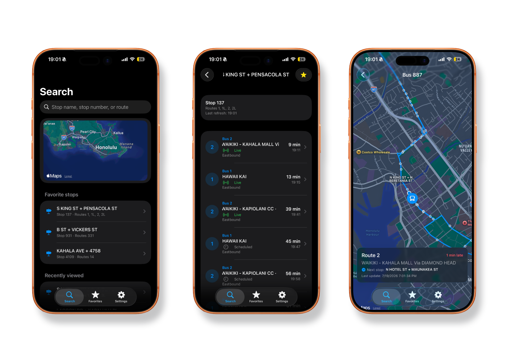

# TheBus Live

A modern, unofficial SwiftUI replacement for the old TheBus iOS app, built on top of TheBus's official public Web API (Oahu Transit Services, Inc).

This app is not affiliated with or endorsed by Oahu Transit Services, Inc. Route and arrival data is provided by permission of Oahu Transit Services, Inc, per the terms at https://hea.thebus.org/api_info.asp.

<p align="center">
  
</p>

## What's included

- SwiftUI app built for iOS 17+, built with MVVM architecture. 
- Live arrivals, stop and route search, route details, vehicle tracking on a MapKit map.
- Stop and route search, with full island-wide coverage via bundled GTFS data.
- Route details with polyline maps from GTFS `shapes.txt`.
- Favorites and recently viewed stops, persisted locally via UserDefaults.
- Pull to refresh, loading/empty/error states throughout.
- Light/dark/system appearance toggle, accent color picker, haptics toggle.
- A GitHub Actions workflow that builds the project on macOS runners, since the project is authored on Linux/Windows.
- No third party dependencies: networking uses `URLSession` and `XMLParser`, both part of Foundation.

## Project structure

```
TheBusLive/
├── project.yml                  XcodeGen spec; generates the .xcodeproj
├── TheBusLive/
│   ├── TheBusLiveApp.swift
│   ├── Info.plist
│   ├── Assets.xcassets/
│   ├── Models/
│   │   ├── Stop.swift           GTFS stop data with coordinates
│   │   ├── Route.swift          Route metadata from API
│   │   ├── Arrival.swift        Predicted/scheduled arrivals
│   │   ├── Vehicle.swift        Live vehicle position and status
│   │   ├── RouteShapes.swift    Polylines from GTFS shapes.txt
│   │   └── AppPreferences.swift Theme, color, debug toggles
│   ├── Networking/
│   │   ├── APIClient.swift      Actor-based networking, XML parsing
│   │   ├── APIConfig.swift      API key and constants
│   │   ├── Endpoints.swift      Request URL building
│   │   └── APIError.swift       Error types with cancellation detection
│   ├── ViewModels/
│   │   ├── StopViewModel.swift  Fetches and sorts arrivals
│   │   ├── RouteViewModel.swift Route search and lookup
│   │   └── VehicleMapViewModel.swift Auto-refreshing vehicle tracking
│   ├── Views/
│   │   ├── ContentView.swift    Tab bar root
│   │   ├── HomeView.swift       Favorites, recents, map preview
│   │   ├── SearchView.swift     Stop and route search
│   │   ├── StopDetailView.swift Live arrivals list
│   │   ├── RouteView.swift      Route details with polyline
│   │   ├── MapView.swift        Vehicle tracking map, controls, and styling
│   │   ├── AllStopsMapView.swift Island-wide stops with smart thinning
│   │   ├── FavoritesView.swift  Drag-to-reorder starred stops
│   │   ├── SettingsView.swift   Appearance, haptics, debug, privacy
│   │   ├── ArrivalRow.swift     Single arrival display
│   │   ├── StopRow.swift        Stop list item
│   │   ├── StatusView.swift     Loading/empty/error placeholder
│   │   ├── MarqueeText.swift    Auto-scrolling text for long labels
│   │   ├── HapticsManager.swift Centralized haptic feedback
│   │   └── GlassCompat.swift    iOS 26 Liquid Glass backcompat
│   └── Storage/
│       └── FavoritesManager.swift Favorites/recents persistence
└── .github/workflows/ios-build.yml CI/CD
```

### Why XcodeGen instead of a committed? `.xcodeproj`

Hand-maintained `.xcodeproj` files are XML/plist based, are fragile to merge conflicts, and drift out of sync with the file system easily, especially when a project is edited outside Xcode. Instead, `project.yml` declares the target, sources, and settings; both CI and your local machine run `xcodegen generate` to produce a fresh, correct `.xcodeproj` every time. The generated project is gitignored.

## About TheBus API

TheBus's public Web API (documented at https://hea.thebus.org/api_info.asp) is a **read-only, XML-based** API with three endpoints:

| Endpoint | Purpose |
|---       |      ---|
| `GET http://api.thebus.org/arrivals/?key=API_key&stop=stop_ID`   | Live/scheduled arrivals for a stop  |
| `GET http://api.thebus.org/vehicle/?key=API_key&num=vehicle_num` | Live position of a specific vehicle |
| `GET http://api.thebus.org/route/?key=API_key&route=route_num` (or `&headsign=text`) | Route lookup by number or headsign text |

There is no dedicated stop search endpoint in the official API. This app ships with a small bundled sample stop list (`Stop.sampleStops`) so search and favorites work out of the box; for full island coverage, bundle TheBus's GTFS `stops.txt` (available from TheBus's developer resources) as a JSON resource and load it in `SearchView` in place of `Stop.sampleStops`.

Because responses are XML, `APIClient.swift` includes a small dependency-free `XMLParser`-based mapper rather than pulling in a third-party XML or JSON library.

## Setup: creating your API key
 
1. Register for a free AppID at **https://api.thebus.org/NewAccount/**. Registration requires an email address; OTS uses it to notify you of API changes. Each AppID is limited to 250,000 requests/day by default and is deleted after 6 months of inactivity. You may request a higher daily limit for an AppID by emailing api@thebus.org.
2. Open the app.
3. Replace the placeholder API key in Settings with your actual AppID:
```swift
   static let key = "abcd1234-your-real-appid"
```
4. Save. No other code changes are required; every request in `APIClient` reads from `APIConfig.key`.
If you build or run without replacing the placeholder, the app will surface a clear "No TheBus API key is configured" error instead of making a doomed network request.

## Building via GitHub Actions
 
The workflow at `.github/workflows/ios-build.yml` runs on `macos-26` runners and:
 
1. Selects Xcode 26
2. Installs XcodeGen via Homebrew
3. Generates `TheBusLive.xcodeproj` from `project.yml`
4. Builds the Debug configuration for a generic iOS device (compile check)
5. Archives the Release configuration, unsigned
6. Packages an unsigned `.ipa` (a zipped `Payload/TheBusLive.app`)
7. Uploads both the `.ipa` and the raw `.xcarchive` as workflow artifacts
It triggers on pushes and pull requests to `main`, and can also be run manually from the Actions tab (`workflow_dispatch`).
 
- To get your build artifacts, you can either fork this repo and open a PR (e.g. to add a build toggle), 
- checking the latest releases at https://github.com/ashvr0/TheBusLive/releases. 
- The IPA can be installed via SideStore, LiveContainer, or any similar sideloading method, using: https://raw.githubusercontent.com/ashvr0/TheBusLive/refs/heads/main/source.json
 
## Installing via SideStore
 
SideStore signs and installs apps using your own free or paid Apple Developer account. Free accounts require apps to be refreshed approximately every 7 days.
 
1. Install SideStore by following the [official SideStore installation guide](https://docs.sidestore.io/docs/installation/prerequisites). You will need:
   * An iPhone or iPad running iOS or iPadOS 15.0 or later [with a passcode](https://support.apple.com/en-us/119586) enabled.
   * A Windows, macOS, Linux, or supported Chromebook computer for the initial installation.
   * An Apple Account.
   * A WiFi connection.
2. Install the **LocalDevVPN** app from the App Store and enable the VPN. The VPN must be connected whenever you install, update, or refresh apps with SideStore.
3. Install **iLoader** on your computer and complete the SideStore setup.
4. Download `TheBusLive-unsigned.ipa` from the GitHub Actions run. If it is provided as a ZIP archive, extract it to obtain the `.ipa` file, or import the ZIP directly.
5. Transfer the file to your iPhone using AirDrop, the Files app, iCloud Drive, or another supported method.
6. Open the file with SideStore, or tap the `+` button in SideStore and select the `.ipa` file.
7. SideStore will sign the app using your Apple Developer account and install it. If this is the first app signed with your account, you may be prompted to trust the developer profile in **Settings** > **General** > **VPN & Device Management**.
8. Launch TheBus Live from your Home Screen.


## Notes
 
Vehicle tracking polls every 30 seconds while the map is open; TheBus's own AVL data is refreshed roughly once a minute, so this has headroom without over-polling.
 
The app does not collect or transmit any analytics, usage data, or personal information. Favorites and recents are stored locally on your device only.
 
If you encounter issues, open an issue: [issue](https://github.com/ashvr0/app/issues/new).
 
## License
 
This project is licensed under the **GPL** — see the [LICENSE](https://github.com/ashvr0/app?tab=GPL-3.0-1-ov-file) file for details.
 
## Attribution
 
TheBus's Terms of Use require any app displaying their data to show the legend "Route and arrival data provided by permission of Oahu Transit Services, Inc." This is already included as `APIConfig.attributionText` and shown in Home, Route, and Settings screens. Keep it if you fork this project.
